# Nama  = Muhammad Iqbal Fadillah

# Kelas = TI.22 B.2

# NIM   = 312210586

# Mata Kuliah = Bahasa Pemrograman

# PERTEMUAN-10

# 
PROGRAM

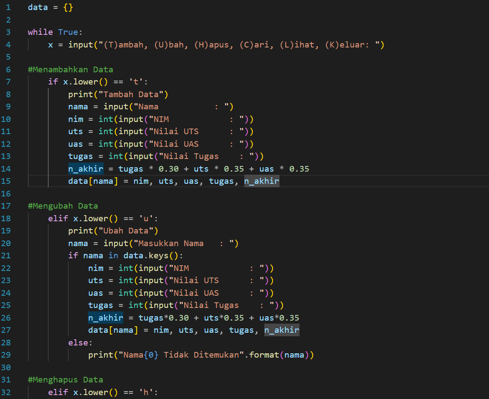
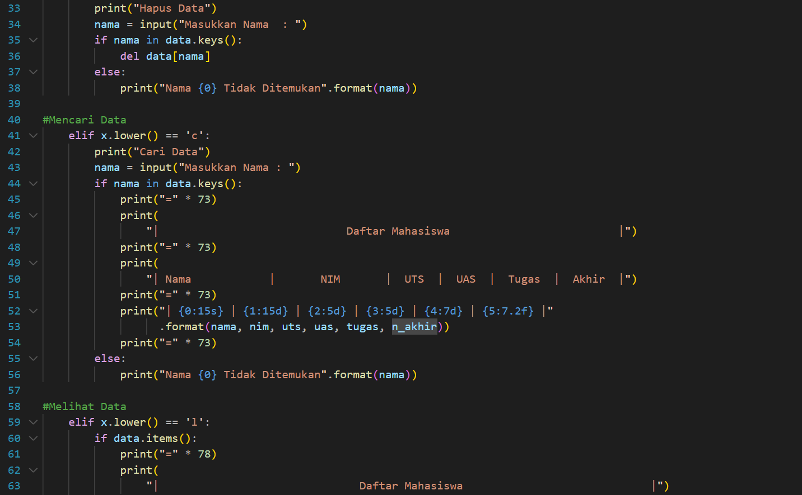
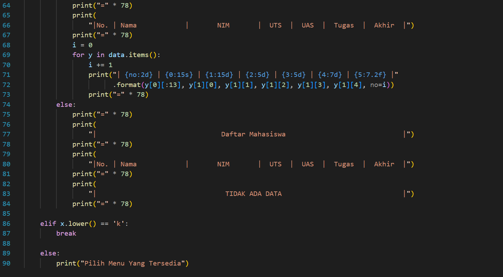

# 
PENJELASAN
 
* Mendeklarasikan Dictonary kosong dengan synatax data = {}
* Lalu membuat perulangan while dan untuk menginisialkan penambahan menu pilihan Tambah, Ubah, Hapus, Cari, Lihat, dan Keluar 
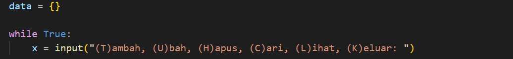

# 
MENAMBAHKAN DATA

* Berikut adalah Syntax untuk menambahkan data dengan ketentuan jika kita mengetikkan T pada keyboard, maka akan melakukan penambahan data dan ditampung kedalam Dictonary data yang telah kita buat, dengan nama sebagai keys dan yang lainnya sbagai values.
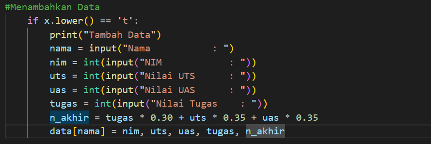

# 
MENGUBAH DATA

* Jika input yang dimasukkan adalah U, di dalam kondisi ini terdapat input dan kondisi, dimana jika input nama ada didalam variabel data maka akan muncul beberapa pilihan untuk mengubah semua data atau data tertentu saja.
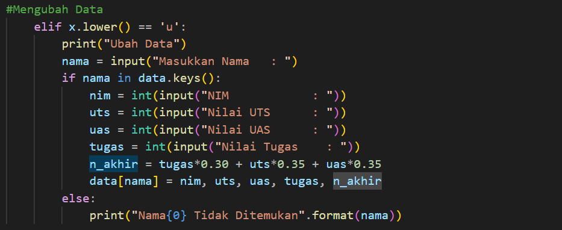

# 
MENGHAPUS DATA

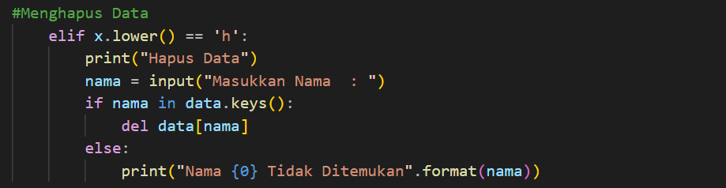

# 
MENCARI DATA

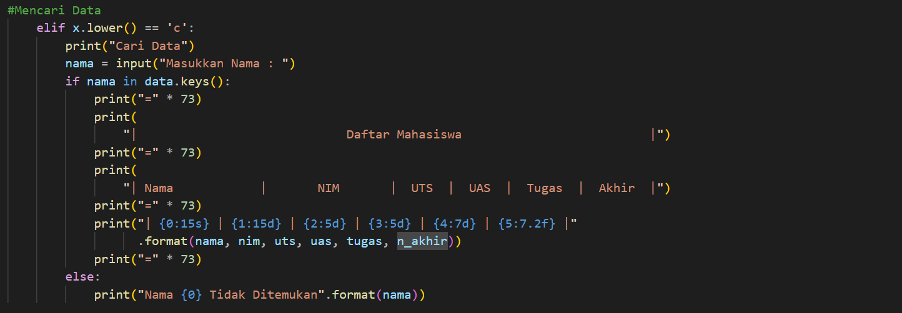

# 
MELIHAT DATA

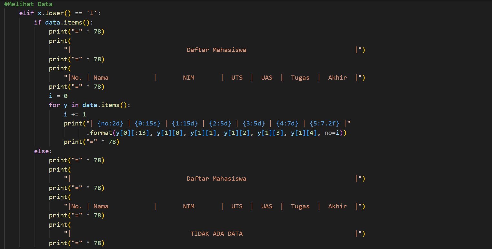
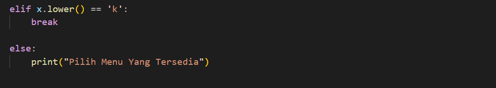

# 
KELUAR

Perulangan diatas adalah perulangan yang akan berjalan terus menerus dan akan berhenti jika kode berikut di eksekusi elif x.lower() == 'k':
* Jika k di input dan lower() digunakan untuk mengkonversi input yang dimasukkan ke bentuk lower case dan input k digunakan berdasarkan perintah yang sudah dimasukan dalam keterangan pada fungsi input dibawah ini:
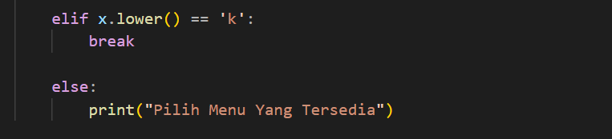

# 
HASIL OUTPUT

* Apabila program dijalankan maka akan menghasilkan output sebagai berikut :
* Menambahkan Data dengan input T dan melihat data dengan input L
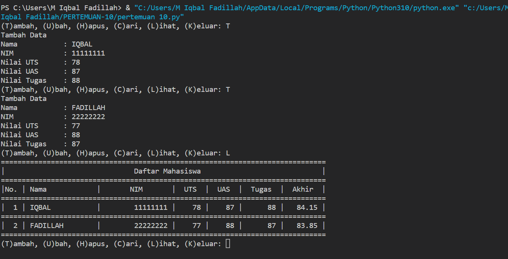
* Mengubah Data dengan input U dan melihat data dengan input L img5
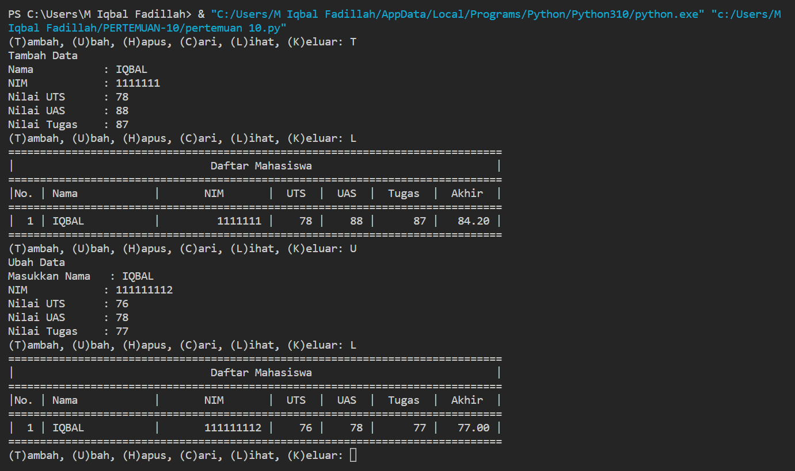
* Menghapus Data dengan input H dan melihat data dengan input L
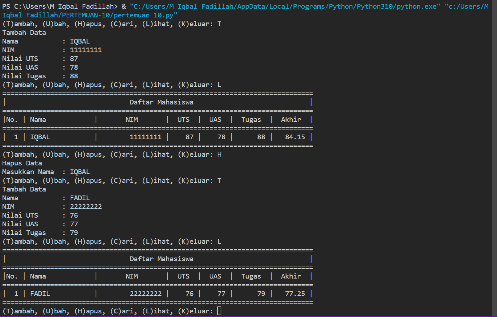
* Mencari Data dengan input C
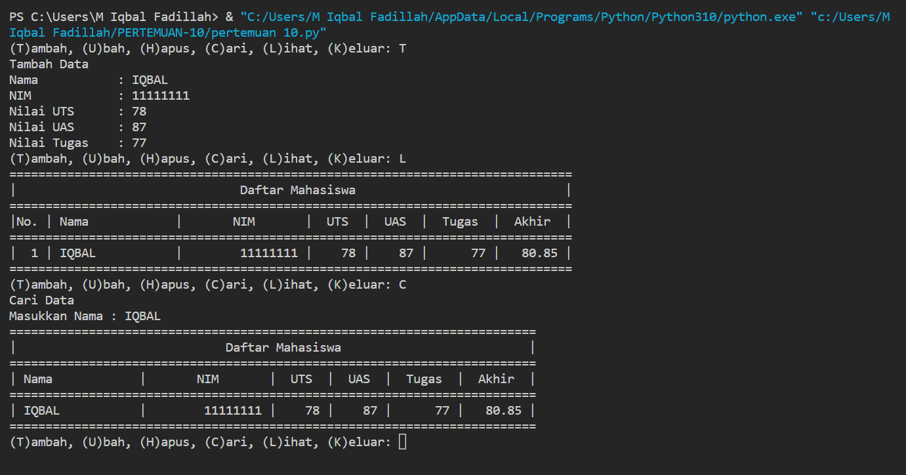
* Keluar dari program dengan input K
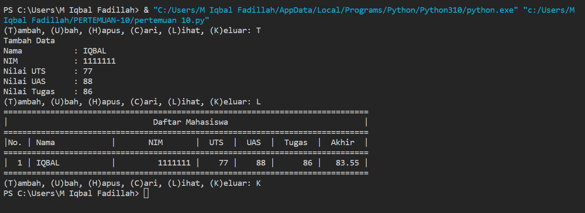
